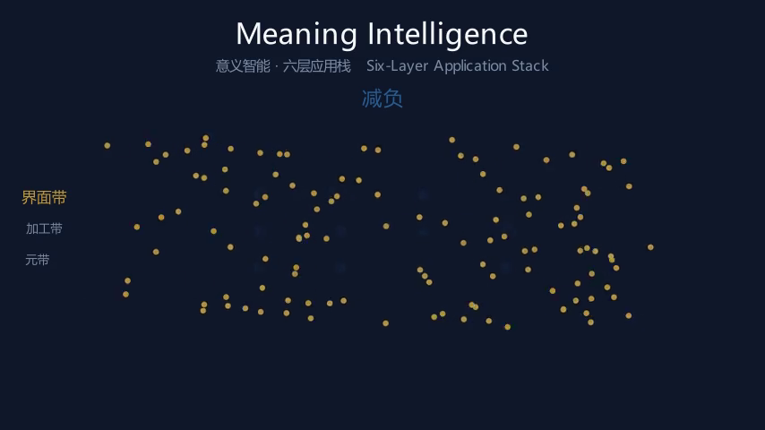
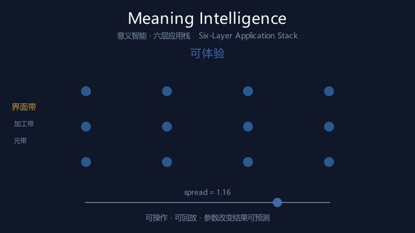
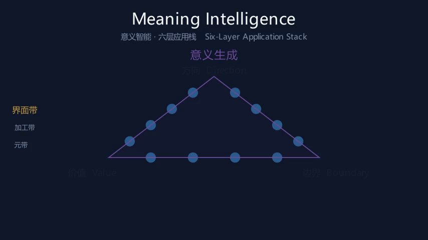
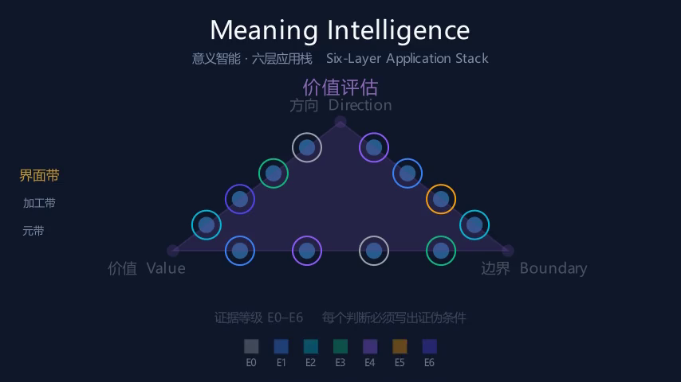
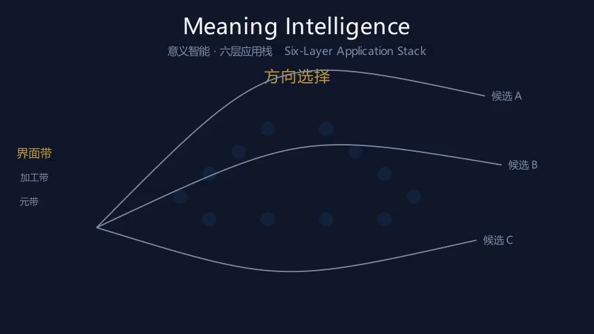
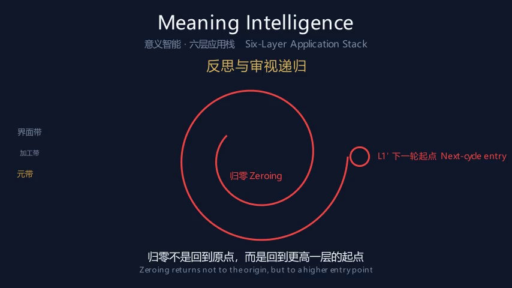

<div align="center">

# 意义智能 · Meaning Intelligence

**元智能理论与六层应用栈的开放研究项目**
*An open research project on meta-intelligence theory and its six-layer application stack*

[](LICENSE)
[](LICENSE-DOCS)
[](https://github.com/sara-protocol/meaning-intelligence/actions/workflows/ci.yml)
[](CHANGELOG.md)

</div>

---

## 这是什么 / What this is

**中文**

本仓库是一个可检验的科学假说的开放工作区，不是一份宣言。

理论正典是一本中文专著《意义智能：意义文明的认知操作系统》V7.0。它把**意义智能**定义为
**对其他智能活动的方向性调控**——不是与逻辑、计算、感知智能并列的第四类智能，而是位于其上的**元层**。
它的追问不是「能不能做到」，而是「值不值得做？对谁值得？在什么尺度上值得？」

本仓库做三件事：

1. **把理论转译为可操作的分层栈。** 六层从「减负」到「反思与审视递归」，每一层都标注了它锚定正典的哪一节、当前证据等级是多少、以及**什么观察会让它作废**。
2. **让每一层可被体验。** `msi/` 里的演示系统用 Manim 动画与单文件交互网页，把六层各自做成可动手、可回放的产物。
3. **把证伪路径公开。** 正典设有理论失败矩阵；本仓库沿用同一承诺——任何模块达到失败阈值，将被**标记或删除**，而不是被辩护。

**English**

This repository is a working area for a testable scientific hypothesis, not a manifesto.

The canonical text is a Chinese monograph, *Meaning Intelligence: The Cognitive Operating System of
Meaning Civilization*, V7.0. It defines **meaning intelligence** as the **directional regulation of
other intelligent activities** — not a fourth kind of intelligence alongside logical, computational,
and perceptual intelligence, but a **meta-layer** above them. Its question is not "can it be done"
but "is it worth doing — worth it for whom, and at what scale?"

The repository does three things:

1. **Translates the theory into an operable layered stack.** Six layers, from *load reduction* to
   *recursive reflection*, each labelled with the canon section it anchors to, its current evidence
   level, and **what observation would falsify it**.
2. **Makes each layer experiential.** The demonstration system in `msi/` uses Manim animation and a
   single-file interactive web page to turn each layer into something you can operate and replay.
3. **Publishes the falsification path.** The canon carries a Theory Failure Matrix; this repository
   keeps the same commitment — any module reaching its failure threshold will be **marked or
   removed**, not defended.

---

## 六层应用栈 / The six-layer application stack

| 层 | 名称 | Layer | 一句话定义 | 锚定正典 | 证据等级 |
|---|---|---|---|---|---|
| **L1** | 减负 | Cognitive Load Reduction | 把认知负荷从信息量转移到结构 | 第1章 1.1；工具 A.1 | E1（机制 E3） |
| **L2** | 可体验 | Experiential Rendering | 把「读到」变成「操作到」 | 第3章；第9章 M1 | E1（机制 E3） |
| **L3** | 意义生成 | Meaning Generation | 组织成方向·价值·边界 | 第3章 3.1 / 3.2；第8章 8.1 光谱带 | E0–E1 |
| **L4** | 价值评估 | Value Assessment | 为判断标注证据强度 | 第6章 E0–E6；3.3 PE 方程 | E2（工具）/ E1（模型） |
| **L5** | 方向选择 | Direction Selection | 在五尺度上选定值得的方向 | 第4章；DC 指标；三级修正 | E1 |
| **L6** | 反思与审视递归 | Recursive Reflection and Review | 让系统审视自己的审视 | 第7章 7B.2/7B.3/7B.4 三特性；失败矩阵 | E2（案例）/ E1 |

六层按认知距离分为三带：**界面带**（L1–L2，解决「信息进不来」）、**加工带**（L3–L4，解决「意义出不来」）、
**元带**（L5–L6，解决「方向守不住」）。只有元带能改写下层前提——这是「元」的形式特征。

> ### ⚠️ 关于六层栈本身 / A note on the stack itself
>
> 六层栈是一个**整合结构**，它的证据等级是 **E0（概念）**，尚未经过独立检验。
> 请把它当作一个**待检验的组织工具**，而不是一个已证实的发现。
> 若出现更简洁且解释力更强的切分，应当**替换**它，而不是为它辩护。
>
> The six-layer stack is an **integrative structure** at evidence level **E0 (conceptual)**. It has not
> been independently tested. Treat it as a **testable organizing tool**, not a confirmed finding.
> If a simpler partition with greater explanatory power emerges, it should **replace** this one.


---

## 六幕动画 / The six acts

`msi/scenes/meaning_intelligence.py` 用六幕动画逐层演示这个栈。以下是从实际渲染成片中抽取的画面：

| | |
|---|---|
| **L1 减负** — 120 个无序粒子收敛为 12 个结构节点<br> | **L2 可体验** — 出现可操作控件，节点随参数实时重排<br> |
| **L3 意义生成** — 节点归位到 方向·价值·边界 三角<br> | **L4 价值评估** — 每个节点套上 E0–E6 证据色环<br> |
| **L5 方向选择** — 三条候选路径，两条淡出，一条高亮<br> | **L6 反思与审视递归** — 螺旋回写至同角度的更高起点 L1′<br> |

成片 `msi/MeaningIntelligenceScene.mp4` 与实测时间轴 `msi/timeline.json` 一并入库，
因此全新克隆打开 `msi/meaning_intelligence.html` 即可直接播放并对齐每一层。

---

## 快速开始 / Quick start

### 白皮书 / The white paper

中英双语，《意义智能 · 元智能理论与分层应用》公开发布白皮书 v1.0，19 页。

```bash
cd whitepaper
pip install python-docx pillow
python make_figures.py        # 生成两张插图
python build_whitepaper.py    # 生成 DOCX
```

产物在 `whitepaper/dist/`。DOCX 由脚本生成——**请不要直接改 DOCX**，改生成脚本。

### 演示系统 / The demonstration system

```bash
cd msi
pip install manim
./run.sh          # Linux / macOS / Git-Bash
# 或
./run.ps1         # Windows PowerShell
```

脚本会渲染六幕动画、把 MP4 复制到 HTML 同级目录、并注入实测时间轴构建
`meaning_intelligence.html`。用浏览器打开它即可逐层操作。

> 只想构建页面、不渲染动画？直接 `python build.py` —— 会退回预算时间轴（页面会明确提示这一点）。

---

## 仓库结构 / Repository layout

```
.
├── index.html              公开发布落地页（单文件，零外部依赖，可直接用 GitHub Pages 发布）
├── msi/                    演示系统：Manim 六幕动画 + 单文件交互页
│   ├── config.json         六层 / 三带 / 证据色阶，全部数据化
│   ├── mi_common.py        路径、配置、UTF-8 控制台兜底
│   ├── build.py            把配置与时间轴注入 HTML 模板
│   ├── scenes/             六幕 Manim 场景
│   ├── templates/          HTML 模板
│   └── run.sh / run.ps1    一键渲染 + 构建
├── whitepaper/             中英双语白皮书的生成脚本与产物
│   ├── make_figures.py     插图（PIL）
│   ├── build_whitepaper.py 正文（python-docx）
│   └── dist/               发布的 DOCX / PDF
├── toolkit/                十份可填写的实践工具模板（对应正典附录 A）
├── docs/                   架构、证据体系、失败矩阵、路线图、术语、**自动化治理**
├── tools/
│   ├── publish.py          无需 git 的 GitHub 发布器（纯 REST API）
│   ├── verify_html.py      校验构建产物：占位符残留 + 内联 JS 真实语法检查
│   └── verify_issue_forms.py  按 GitHub 官方 schema 校验 issue 表单结构
├── .github/workflows/
│   ├── ci.yml              构建校验
│   ├── triage.yml          issue 分诊（完整度检查 + 可选 AI 归类）
│   └── maintenance.yml     每周维护（升级未被回复的证伪报告、周报）
├── CITATION.cff            引用信息
└── CONTRIBUTING.md         如何贡献（尤其是如何提交证伪报告）
```

> **落地页**：`index.html` 是单文件、零外部资源的发布页——没有 CDN、没有字体外链、没有统计脚本，离线打开亦完整可用。
> 在仓库 Settings → Pages 里把 Source 设为 `main` / `(root)` 即可发布（`.nojekyll` 已就位）。

---

## 自动化做了什么、被禁止做什么 / What automation may and may not do

仓库有 issue 分诊与每周维护的自动化。它的权限被刻意收窄，因为**一个自动过滤批评的机器人会摧毁这个仓库存在的理由**：

| ✅ 做 | ⛔ 不做 |
|---|---|
| 机械打标签、检查报告字段是否完整 | 判定「证伪无效」 |
| AI 起草分诊草稿（自标为机器产物） | 以维护者身份回复理论争议 |
| 把无人回复的证伪报告**升级**给维护者 | 自动关闭任何 issue |

**本仓库不自动关闭 issue**（`days-before-issue-close: -1`）。详见
[docs/automation.md](docs/automation.md)——那里写明了四条红线及其理由。

---

## 如何贡献 / Contributing

最有价值的贡献**不是**加功能，而是**提交证伪报告**。

> 如果你发现某条主张与观测不符、某个失败阈值的判定标准有漏洞、或某层的操作化无法复现，
> 请用 [证伪报告模板](.github/ISSUE_TEMPLATE/falsification_report.yml) 开一个 issue。
> 报告需要附带：涉及的假设或层、观测描述、样本与统计（效应量、p 值、统计功效）、
> 以及它**为什么**构成证伪——即对照正典中该假设的预注册证伪标准。

详见 [CONTRIBUTING.md](CONTRIBUTING.md)。核心行为期待：**可以攻击理论，不可以攻击人。**

---

## 引用 / Citation

见 [CITATION.cff](CITATION.cff)。理论引用请以正典为准：

> 《意义智能：意义文明的认知操作系统》V7.0

---

## 许可证 / License

- **代码**（`msi/`、`tools/`、`whitepaper/*.py`）：[MIT](LICENSE)
- **文档与文字内容**（`docs/`、`whitepaper/`、README 等）：[CC BY 4.0](LICENSE-DOCS)

---

<div align="center">
<sub>证据等级 E0–E6 与理论失败矩阵见正典。本项目以「可失败性」为学术诚信承诺。</sub><br>
<sub>Evidence levels E0–E6 and the Theory Failure Matrix follow the canon. Falsifiability is the integrity commitment.</sub>
</div>
