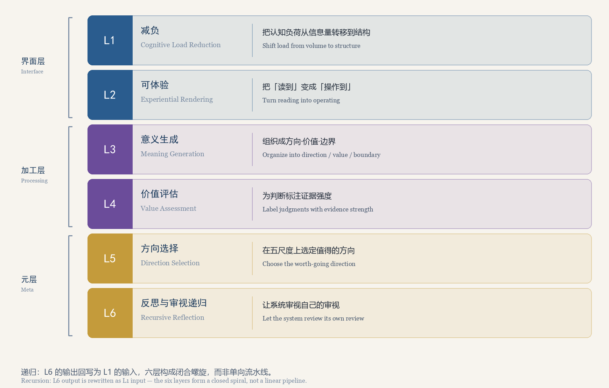

# 文档索引 / Documentation Index

> 这份索引回答一个问题：**我想知道某件事时，该读哪一份文档？**
> This index answers one question: **which document should I read to learn a given thing?**

本目录是仓库的**说明性文档层**，它不新增任何理论主张。所有构念定义、证据等级与失败阈值均以正典
《意义智能：意义文明的认知操作系统》V7.0 与白皮书生成脚本为准；本目录只做一件事——
把已经写下的东西**整理成可查、可引用、可被逐条检验**的形式。

This directory is the repository's **explanatory documentation layer**. It introduces no new
theoretical claims. All construct definitions, evidence levels, and failure thresholds follow the
canon *Meaning Intelligence: The Cognitive Operating System of Meaning Civilization*, V7.0, and the
white paper generator script. This directory does exactly one thing: it arranges what has already
been written into something that can be looked up, cited, and tested item by item.

---

## 文档清单 / Documents

| 文档 Document | 回答什么问题 / What it answers |
|---|---|
| [architecture.md](architecture.md) 系统架构 / System Architecture | 仓库各部分如何分层；`config.json` 到 `meaning_intelligence.html` 的数据如何流动；为什么时间轴必须实测注入而不能手写；六层如何映射到正典的 M1/M2/M3 与 F1–F4。 How the repository is layered; how data flows from `config.json` to `meaning_intelligence.html`; why the timeline must be measured rather than hand-written; how the six layers map onto canon modules M1/M2/M3 and processes F1–F4. |
| [evidence.md](evidence.md) 证据体系 / Evidence System | E0–E6 各自是什么；六层各自的证据等级是多少；为什么必须区分「本框架内的操作化等级」与「底层机制的证据等级」。 What E0–E6 each mean; the evidence level of each layer; why "operationalization level inside this framework" must be kept apart from "evidence level of the underlying mechanism". |
| [failure-matrix.md](failure-matrix.md) 理论失败矩阵 / Theory Failure Matrix | 每一层的支持证据、部分支持、失败阈值与失败后操作分别是什么；触及阈值后按什么规则处置。 Each layer's supporting evidence, partial support, failure threshold, and post-failure action; the rule applied once a threshold is reached. |
| [roadmap.md](roadmap.md) 路线图 / Roadmap | 正典五阶段路线图各阶段做什么；本仓库定位在哪一阶段；0.1.0 已完成什么、下一步做什么。 What each of the canon's five roadmap phases does; where this repository sits; what 0.1.0 already delivers and what comes next. |
| [glossary.md](glossary.md) 术语对照 / Glossary | 一个术语（意义智能、PE、DC、BS、SD、RZ、MC、MCA/SA/AZ、M1–M3、F1–F4……）的中文、英文与正典出处；以及六层各自的中英文名。 The Chinese name, English name, and canon source of each term (meaning intelligence, PE, DC, BS, SD, RZ, MC, MCA/SA/AZ, M1–M3, F1–F4, …), plus the bilingual names of the six layers. |

---

## 先读哪一份 / Where to Start

- **第一次接触本项目**：先读仓库根目录的 [README](../README.md)，再读本目录的 [architecture.md](architecture.md)。
  First contact: read the repository [README](../README.md), then [architecture.md](architecture.md).
- **想检验、想反驳**：直接读 [failure-matrix.md](failure-matrix.md) 与 [evidence.md](evidence.md)，
  并按 [CONTRIBUTING.md](../CONTRIBUTING.md) 的流程提交证伪报告。
  Want to test or refute: go straight to [failure-matrix.md](failure-matrix.md) and
  [evidence.md](evidence.md), then file a falsification report following
  [CONTRIBUTING.md](../CONTRIBUTING.md).
- **想读懂白皮书里的措辞**：读 [glossary.md](glossary.md)。
  Want to read the white paper's wording correctly: read [glossary.md](glossary.md).
- **想知道这个项目接下来做什么**：读 [roadmap.md](roadmap.md)。
  Want to know what happens next: read [roadmap.md](roadmap.md).

---

## 与白皮书的关系 / Relation to the White Paper

白皮书是**由脚本生成**的，不是手写文档：

- 正文与结构：[`whitepaper/build_whitepaper.py`](../whitepaper/build_whitepaper.py)
- 排版与样式：[`whitepaper/docx_style.py`](../whitepaper/docx_style.py)
- 插图：[`whitepaper/make_figures.py`](../whitepaper/make_figures.py)
- 发布产物：[`whitepaper/dist/`](../whitepaper/dist)

本目录的文档**引用**白皮书的表 1–表 7，但不复述其全部内容；两者冲突时以白皮书与正典为准。
请不要直接编辑 `whitepaper/dist/` 下的 DOCX 或 PDF——它们会在下一次构建时被覆盖。

The white paper is **generated by scripts**, not hand-written. The documents in this directory
**cite** Tables 1–7 of the white paper rather than restating them; where the two disagree, the white
paper and the canon prevail. Do not edit the DOCX or PDF under `whitepaper/dist/` directly — they are
overwritten by the next build.

---

## 引用与一致性约定 / Citation and Consistency Rules

1. **不回填未标注的数字。** 本目录不给出实验数据、样本量或效应量；这些只在有据可查时出现。
   No unsourced numbers. This directory reports no experimental data, sample sizes, or effect
   sizes except where a source exists.
2. **中英双语一致性。** 英文表述的证据强度**不得强于**中文。
   Bilingual consistency. The English wording must **never** be stronger than the Chinese.
3. **术语以正典章节为准。** 出处不明确的术语应标注 `TODO(source)`，而不是猜测章节号。
   Terms follow canon sections. A term without a verified source is marked `TODO(source)` rather than
   given a guessed section number.

---

## 许可证 / License

本目录属于**文档与文字内容**，适用 [CC BY 4.0](../LICENSE-DOCS)；
代码部分适用 [MIT](../LICENSE)。

This directory is **documentation and prose**, licensed under [CC BY 4.0](../LICENSE-DOCS); code is
under [MIT](../LICENSE).

本目录不主张任何模块已达到高证据等级；各模块当前等级见 <a href="evidence.md">evidence.md</a>。 
This directory claims no module at a high evidence level; see <a href="evidence.md">evidence.md</a> for current levels.

