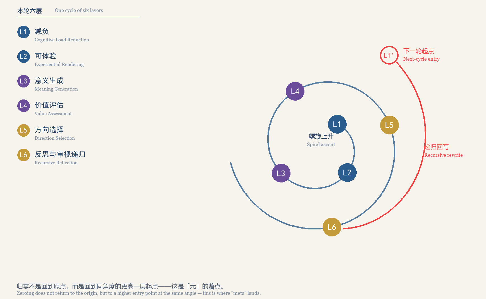
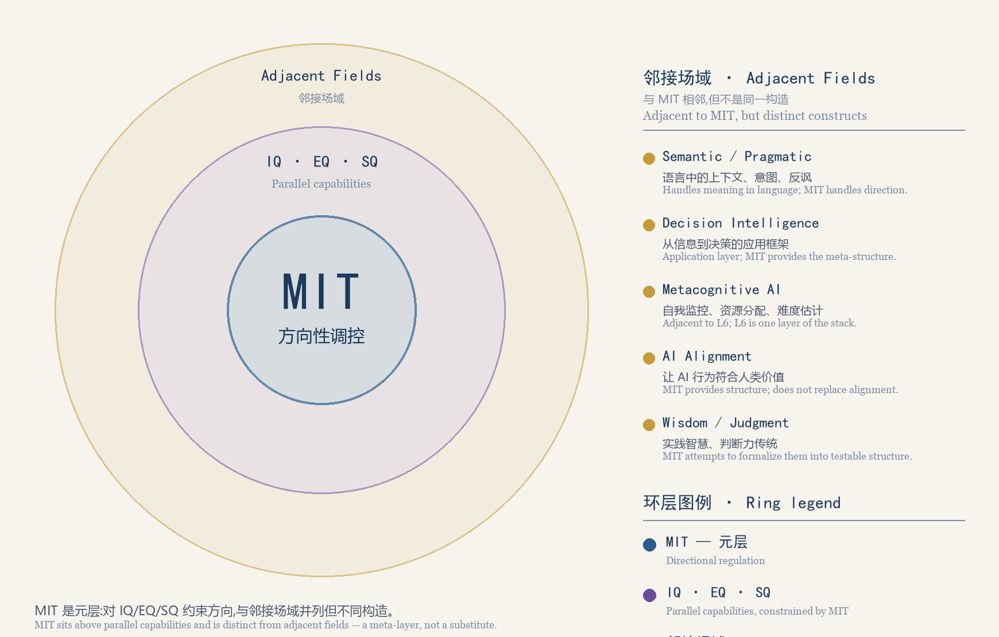

# 系统架构 / System Architecture

> 这份文档回答一个问题：**这个仓库由哪些部分组成，数据如何在其中流动，以及哪些环节是刻意设计成这样而不是那样的？**
> This document answers one question: **what parts make up this repository, how does data move through them, and which design decisions are deliberate rather than incidental?**

---

## 一、仓库分层 / Repository Layering

分层判据不是目录大小，而是「改动它会牵动什么」。依赖方向单向：`whitepaper/` 与 `msi/` 互不依赖，
`docs/` 只读它们，`tools/` 只读 `msi/` 的产物。

Layers are divided by **blast radius**, not directory size. Dependencies run one way: `whitepaper/` and
`msi/` are independent, `docs/` only reads them, and `tools/` only reads `msi/` output.

| 目录 / Directory | 角色 Role | 改动它的影响 Blast radius |
|---|---|---|
| [`msi/`](../msi) | **演示系统**：六层栈的可操作实现（Manim 场景 + 单文件交互页构建）<br>**Demonstration system**: an operable implementation of the six-layer stack | `config.json` 是唯一数据源，改它会同时影响动画与页面；`timeline.json` 是渲染产物，不是手写输入<br>`config.json` is the single source of truth; `timeline.json` is a render artifact |
| [`whitepaper/`](../whitepaper) | **生成脚本与产物**：正文、排版、插图，以及 `dist/` 下已发布的 DOCX/PDF<br>**Generator scripts and artifacts**: body, layout, figures, released DOCX/PDF | 改脚本会改变发布产物；直接改 `dist/` 下的二进制会被下一次构建静默覆盖<br>Script edits change the release; edits to `dist/` binaries are overwritten |
| `docs/` | **说明性文档层**（本目录）：架构、证据、失败矩阵、路线图、术语<br>**Explanatory documentation layer** (this directory) | 只引用不定义；与正典冲突时以正典为准<br>Cites only, defines nothing; the canon prevails on conflict |
| [`tools/`](../tools) | **校验工具**：[`verify_html.py`](../tools/verify_html.py) 检查占位符残留与内联 JS 真实语法<br>**Verification tooling** | 只读产物，不写仓库内容<br>Reads artifacts only |
| [`.github/`](../.github) | **贡献入口与 CI**：issue 表单（含证伪报告模板）、PR 模板、工作流<br>**Contribution entry points and CI** | 模板坏掉等于贡献入口坏掉；CI 不渲染 Manim，也不自动提交产物<br>A broken template is a broken entry point |

---

## 二、数据流架构图 / Architecture at a Glance

```
    ┌───────────────────────────────────────────────────────┐
    │ msi/config.json —— 唯一数据源 / single source of truth │
    │ 六层 L1–L6 · 三带 bands · 证据色阶 E0–E6               │
    └──────────┬─────────────────────────────┬──────────────┘
               ▼                             ▼
  ┌──────────────────────────┐  ┌───────────────────────────────┐
  │ msi/scenes/              │  │ msi/mi_common.py              │
  │  meaning_intelligence.py │  │  load_config()                │
  │ 六幕动画 Act1…Act6       │  │  calculate_layer_             │
  │ 每幕 self.mark() 打点     │  │   timestamps()（预算时间轴）   │
  └────────────┬─────────────┘  └───────────────┬───────────────┘
               │ export_timeline()              │ 仅在缺失时回退
               ▼                                │ fallback only
  ┌──────────────────────────┐                  │
  │ msi/timeline.json        │                  │
  │ 实测时间轴（渲染产物）     │                  │
  └────────────┬─────────────┘                  │
               └───────────────┬────────────────┘
                               ▼
         ┌───────────────────────────────────────────┐
         │ msi/build.py                              │
         │  注入 LAYERS / BANDS / EVIDENCE            │
         │  注入 TIMELINE + TIMELINE_SOURCE           │
         │   （"measured" 或 "planned"）              │
         │  扫描残留 {{...}}，有残留即非零退出         │
         └─────────────────────┬─────────────────────┘
                               ▼
         ┌───────────────────────────────────────────┐
         │ msi/meaning_intelligence.html             │
         │  单文件交互页：视频 + 时间轴联动 + 六层导航  │
         │  SOURCE === "planned" 时页面显示提示        │
         └─────────────────────┬─────────────────────┘
                               ▼
         ┌───────────────────────────────────────────┐
         │ tools/verify_html.py                      │
         │  占位符残留 · node --check 内联 JS · 抽查   │
         └───────────────────────────────────────────┘
```

`{{...}}` 指模板占位符。[`mi_common.py`](../msi/mi_common.py) 被 Manim 场景与构建脚本共用，因此两者
对「层顺序」与「层名」的理解不会漂移——层顺序由 `LAYER_ORDER = ["L1" … "L6"]` 单点定义。

`{{...}}` denotes a placeholder. `mi_common.py` is shared by the scene and the builder, so the two
cannot drift on layer order or names — order is defined once, in `LAYER_ORDER`.

---

## 三、MSI 数据流：四步 / The MSI Data Flow in Four Steps

1. **配置**：[`msi/config.json`](../msi/config.json) 定义每层的 `name` / `en` / `color` / `evidence` /
   `mechanism_evidence` / `duration`，以及三带与 E0–E6 色阶。文案修改一律从它开始。
   **Config**: per-layer names, colour, evidence level, mechanism evidence level, and duration, plus bands and palette.
2. **渲染**：[`msi/scenes/meaning_intelligence.py`](../msi/scenes/meaning_intelligence.py) 逐幕推进，
   每幕用 `self.mark()` 记录进入与退出时刻，结束时 `export_timeline()` 写出
   [`msi/timeline.json`](../msi/timeline.json)。
   **Render**: each act stamps entry and exit via `self.mark()`; `export_timeline()` writes `timeline.json`.
3. **构建**：[`msi/build.py`](../msi/build.py) 把配置与时间轴作为**合法 JS 字面量**注入
   [`msi/templates/html_template.html`](../msi/templates/html_template.html)，产出单文件页面；随后扫描
   残留占位符，有残留即非零退出——不静默产出坏页面。
   **Build**: injects config and timeline as **valid JS literals**, then scans for leftover placeholders and exits non-zero on any.
4. **校验**：[`tools/verify_html.py`](../tools/verify_html.py) 做三件事：残留占位符检查、抽出内联
   `<script>` 交给 `node --check` 做**真实语法检查**、关键注入项抽查。
   **Verify**: leftover placeholders, real syntax checking of every inline `<script>` via `node --check`, and spot checks.

一键流程见 [`msi/run.ps1`](../msi/run.ps1) 与 [`msi/run.sh`](../msi/run.sh)：渲染 → 把 MP4 复制到 HTML
同级目录 → `python build.py`。复制那一步不能省：页面引用的是同级目录的文件名，否则 `<video>` 永远黑屏。

The one-command path (`run.ps1` / `run.sh`): render → copy the MP4 next to the HTML → `build.py`. The
copy is not optional — the page references a file name in its own directory, or `<video>` stays black.

---

## 四、时间轴：为什么必须实测注入 / Why the Timeline Must Be Measured

**结论：动画时长由渲染决定，不由脚本里的意图决定。**

**The point: animation duration is decided by the render, not by the intent written in the script.**

- **手写会错位。** 每一幕的实际耗时取决于 `run_time`、等待、以及 Manim 自身的排布与字体度量，这些
  只有在渲染完成时才是确定的。手写时间轴会与画面逐渐错开——到第六幕时，页面指向的秒数与屏幕上
  正在发生的事情已经不是同一件事。
  **Hand-writing drifts.** Real duration depends on `run_time`, waits, and Manim's layout and font metrics, known only after rendering. By act six the page points at a moment that no longer matches the screen.
- **打点位置在场景里。** `self.mark()` 记录的是渲染时钟 `self.renderer.time`，因此时间轴描述的是
  **实际发生过的**推进，而不是计划中的推进。实测值的形状见 [`msi/timeline.json`](../msi/timeline.json)。
  **The stamps live in the scene.** `self.mark()` records `self.renderer.time`, so the timeline describes what happened, not what was planned.
- **缺失时不失败，而是降级并提示。** 若 `timeline.json` 不存在（只跑 `python build.py`，或 CI 有意不
  渲染 Manim），`build.py` 用 `calculate_layer_timestamps()` 按 `config.json` 的 `duration` 累加出
  **预算时间轴**，把 `SOURCE` 标为 `"planned"`，页面据此显示提示：当前注入的是预算时间轴，渲染后
  重建即可同步毫秒级数据；缺少的层会另行告警。
  **Missing data degrades instead of failing.** Without it, `build.py` falls back to a **planned timeline** accumulated from each layer's `duration`, sets `SOURCE` to `"planned"`, and the page says so; missing layers are warned about separately.

降级状态因此是**可见的**：读者能区分「这是实测的」和「这是推算的」。这是本项目对证据的态度在工程上的
一个具体落点——不确定处标注不确定，而不是让它看起来一样。

The degraded state is therefore **visible**: a reader can tell "measured" from "extrapolated" — one
concrete engineering instance of this project's stance on evidence.

---

## 五、六层栈与正典运行机制的映射 / Mapping onto Canon Mechanisms

正典的运行机制是**三模块**（M1 感知 / M2 判断 / M3 行动）与**四流程**（F1 意义识别 / F2 意义评估 /
F3 意义决策 / F4 意义反馈）。六层栈不是另起一套机制，而是同一套机制在应用层的分层落点（白皮书表 2）。

The canon's mechanisms are **three modules** (M1 / M2 / M3) and **four processes** (F1–F4). The stack is
where that same mechanism lands at the application layer (white paper Table 2).

| 六层 Layer | 正典三模块 Canon modules | 正典四流程 Canon processes | 主要产出 Primary output |
|---|---|---|---|
| **L1 减负** / Cognitive Load Reduction | M1 感知（输入侧） | F1 意义识别 | 结构化材料 |
| **L2 可体验** / Experiential Rendering | M1 感知（呈现侧） | F1 意义识别 | 可交互产物 |
| **L3 意义生成** / Meaning Generation | M2 判断 | F2 意义评估 | 候选意义结构 |
| **L4 价值评估** / Value Assessment | M2 判断 | F2 意义评估 | 证据强度标注 |
| **L5 方向选择** / Direction Selection | M3 行动 | F3 意义决策 | 方向声明＋偏离阈值 |
| **L6 反思与审视递归** / Recursive Reflection and Review | M1→M2→M3 回环 | F4 意义反馈 | 前提改写＋螺旋回环 |

三带划分由 `config.json` 的 `bands` 定义，动画与页面共用：界面带（L1–L2）解决**信息进不来**，
加工带（L3–L4）解决**意义出不来**，元带（L5–L6）解决**方向守不住**——只有元带能改写下层前提。

The bands come from `bands` in `config.json`: interface (L1–L2) for **information cannot get in**,
processing (L3–L4) for **meaning cannot get out**, meta (L5–L6) for **direction cannot be held** —
and only the meta band can rewrite the premises below it.




图中关键几何：归零后的落点 L1′ 与原点 L1 处于同一角度，但半径更大——L6 到 L1 的那条回边意味着第二轮的
输入标准已被第一轮的 L6 改写。若第二轮与第一轮完全重合，说明这一轮没有产生意义增量。

Key geometry: the post-zeroing point L1′ sits at the same angle as L1 at a larger radius — the L6→L1 back
edge means cycle two's input criteria were rewritten by cycle one's L6. Exact coincidence of the two
cycles means no meaning increment was produced.

---

## 六、这套架构不承诺什么 / What This Architecture Does Not Claim

- 六层栈本身是**整合结构，证据等级 E0**，未经独立检验；在 `config.json` 里把它数据化不会提高它的证据等级。
  The stack is an **integrative structure at E0**, untested; encoding it does not raise that level.
- 演示系统能让每一层**可被体验**，但不能替代对每一层的**检验**。可体验不等于已证实。
  The demo makes each layer *experienceable*; it does not test it. Experiential is not confirmed.

后续阅读：[证据体系](evidence.md) · [理论失败矩阵](failure-matrix.md) · [术语对照](glossary.md)

## 构造边界 / Construct Boundary



MIT 在概念空间中的位置:

| 环 | 内容 | 与 MIT 的关系 |
|---|---|---|
| **内环** | MIT | 元层:对智能活动的方向性调控 |
| **中环** | IQ · EQ · SQ | 平行能力;被 MIT 约束,而非与之并列 |
| **外环** | Semantic / Pragmatic · Decision Intelligence · Metacognitive AI · AI Alignment · Wisdom | 邻接场域;与 MIT 相邻但不同构造 |

**"元"的形式特征**:只有 MIT 位于其他智能活动之上,对它们进行方向约束。IQ 关心「能不能算」,
EQ 关心「能不能相处」,SQ 关心「能不能共处」——三者都在回答「如何做到」。唯有 MIT 追问
「为何要做」以及「值不值得」。

**命名提示**:本项目的 "Meaning Intelligence Theory" 使用 `MIT` 缩写时,指**方向性调控**,
与语义/语用/决策方向的同名 `Meaning Intelligence` 是不同构造。详见
[`docs/glossary.md`](glossary.md) 的命名冲突声明。

