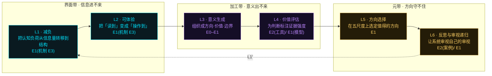
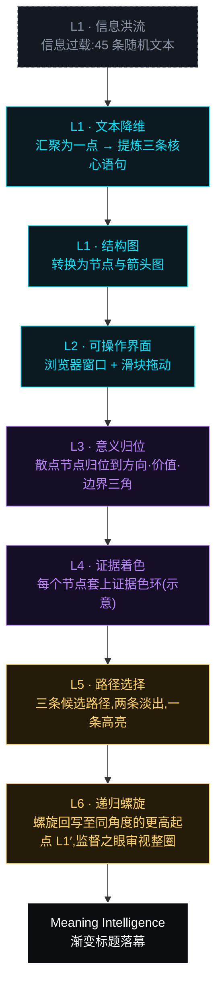
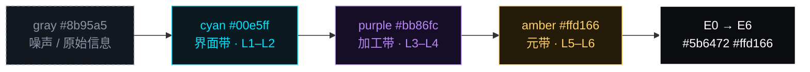
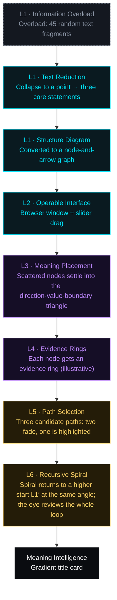
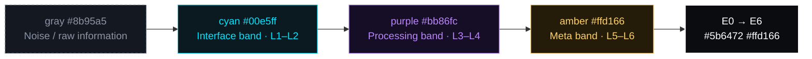

# 意义智能 (Meaning Intelligence) — zh

## 1. 六层应用栈



## 2. 场景结构



## 3. 视觉编码规范



# Meaning Intelligence — en

## 1. Six-layer stack

```mermaid
flowchart LR
    subgraph B0["Interface band · Information can't get in"]
        direction LR
        L1["L1 · Cognitive Load Reduction<br/>Shift cognitive load from information volume to structure<br/>E1(机制 E3)"]:::cyan
        L2["L2 · Experiential Rendering<br/>Turn "read" into "operated"<br/>E1(机制 E3)"]:::cyan
    end
    subgraph B1["Processing band · Meaning can't come out"]
        direction LR
        L3["L3 · Meaning Generation<br/>Organise into direction · value · boundary<br/>E0–E1"]:::purple
        L4["L4 · Value Assessment<br/>Label every judgement with its strength of evidence<br/>E2(工具)/ E1(模型)"]:::purple
    end
    subgraph B2["Meta band · Direction can't hold"]
        direction LR
        L5["L5 · Direction Selection<br/>Choose the worthwhile direction across five scales<br/>E1"]:::amber
        L6["L6 · Recursive Reflection and Review<br/>Let the system review its own reviewing<br/>E2(案例)/ E1"]:::amber
    end
    L1 --> L2 --> L3 --> L4 --> L5 --> L6
    L6 -. "L1′" .-> L1
    classDef gray fill:#141820,stroke:#8b95a5,stroke-dasharray:4 3,color:#8b95a5
    classDef cyan fill:#0a1a20,stroke:#00e5ff,color:#00e5ff
    classDef purple fill:#150e26,stroke:#bb86fc,color:#bb86fc
    classDef amber fill:#241c08,stroke:#ffd166,color:#ffd166
    classDef white fill:#0a0c10,stroke:#ffffff,stroke-width:2px,color:#ffffff
```

## 2. Scene structure



## 3. Visual encoding


